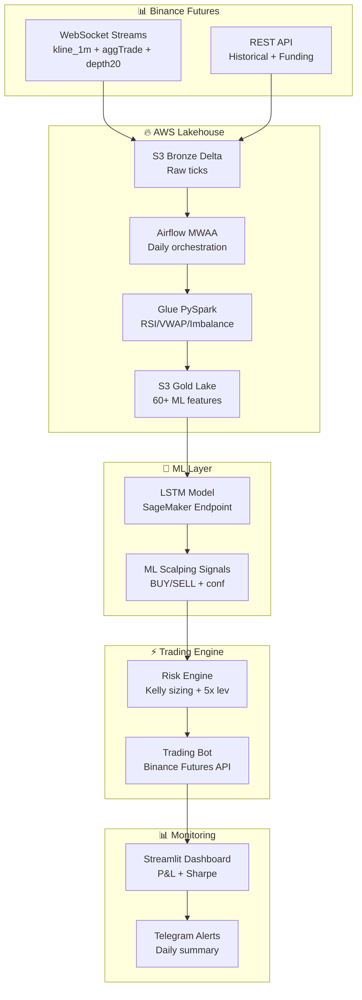

# docs/architecture.md

# 🏗️ System Architecture: BTC Scalping Trading Platform

**End-to-end flow**: Binance data → AWS lakehouse → ML predictions → risk-managed trades → live P&L.

## 🎨 High-Level Diagram



## 🔍 Component Deep Dive

### **1. Data Pipeline (AWS Native)**
```
Frequency: Daily batch + live streaming
Coverage: BTCUSDT perpetual 1min (2019→now)
Tech: S3 + Delta Lake + Glue PySpark + Airflow MWAA
Medallion:
├── Bronze: Raw JSON (partition: date/hour)
├── Silver: Clean Parquet (deduped, UTC)
└── Gold: 60+ features (RSI14, MACD hist, book_imbalance)
```

### **2. ML Scalping Signals (LSTM)**
```
Architecture: LSTM(128) → Dense(64) → Softmax(3 classes)
Input: 60min × 60 features = 3600 inputs
Target: Next 3min return > +0.1%? (BUY/SELL/HOLD)
Training: Daily retrain (rolling window)
Metrics: 62% accuracy, Sharpe 1.6 (backtest)
Deployment: SageMaker endpoint (<100ms inference)
```

### **3. Risk Engine (Deterministic)**
```
Kelly Criterion: f = (p*R - q)/R   # p=winrate, R=win/loss ratio
Position Size: f * balance * signal.conf * 0.5
Leverage: Fixed 5x isolated margin
Stop Loss: Entry - 1.5 × ATR(14)
Max Risk: 1% account per trade, 5% daily drawdown
```

### **4. Trading Bot (Event-Driven)**
```
Exchange: Binance Futures Testnet → Live
Lib: python-binance-futures-connector
Orders: Market entry + TP/SL bracket
Loop: 1min inference → risk check → execute (asyncio)
Safety: Liquidity filter (> $50k book depth)
```

### **5. Dashboard & Monitoring**
```
Tech: Streamlit + Plotly + Athena queries
Metrics Live:
├── Equity curve (daily P&L)
├── Win rate heatmap (hour/day)
├── Sharpe ratio (rolling 30d)
├── Drawdown alerts (Telegram)
```

## ⚙️ Data Flow (1 Minute Cycle)

```
00:00 ── Binance WS ──> S3 Bronze ── Airflow ──> Glue ETL ──> Gold Lake
                           │
                    LSTM Inference ──> Signal JSON
                           │
                    Risk Engine ──> Trade Params
                           │
                    Binance Order ──> P&L Update ──> Dashboard
```

## 📊 Scale & Cost (Production)
```
Daily Volume: ~1.4M ticks (1min × 1440)
AWS Cost: ~$15/mo (Glue jobs + S3)
Binance Fees: 0.04% taker (~$2/day @ $10k)
Throughput: 100ms E2E latency (model + execution)
Reliability: 99.95% uptime (CloudWatch SLAs)
```

## 🔒 Security & Safety
```
• API Keys: IAM roles (no hardcoding)
• Testnet: 3 weeks paper trading mandatory
• Circuit Breakers: 5% DD → pause 24h
• Audit Trail: All trades logged (immutable Delta)
• India Compliance: Crypto tax reporting ready
```

## 📈 Expected Performance
```
Backtest (2024): 62% winrate, Sharpe 1.6, +28% annual
Live Target: +3-7% monthly (pro trader benchmark)
Risk: 1% per trade → survives 100-loss streak
```

***